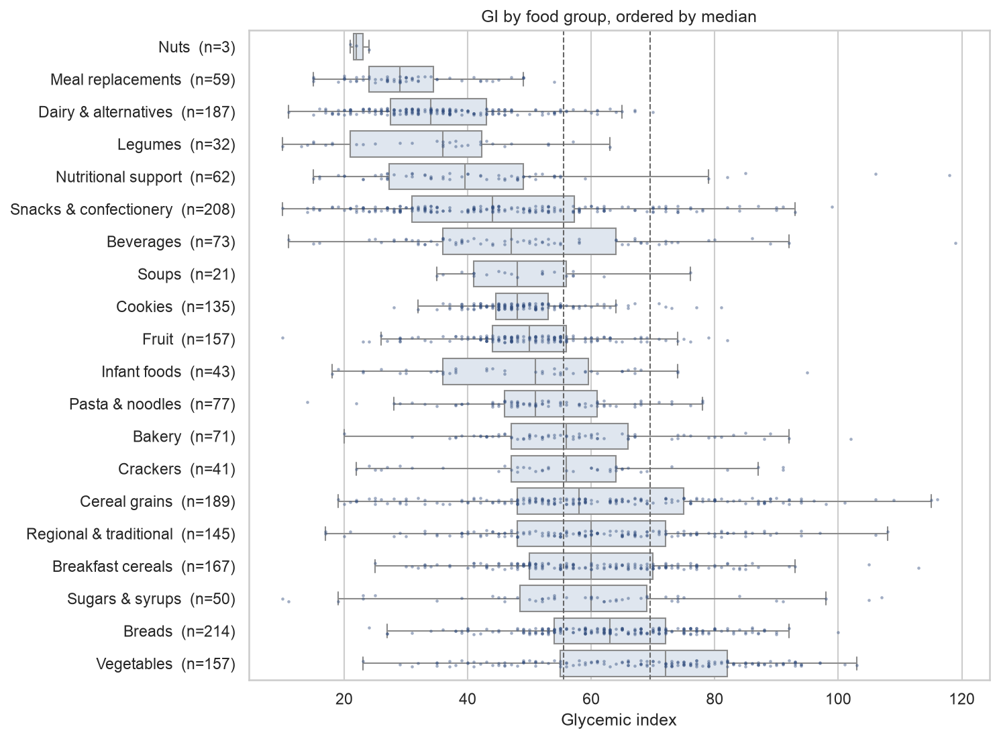
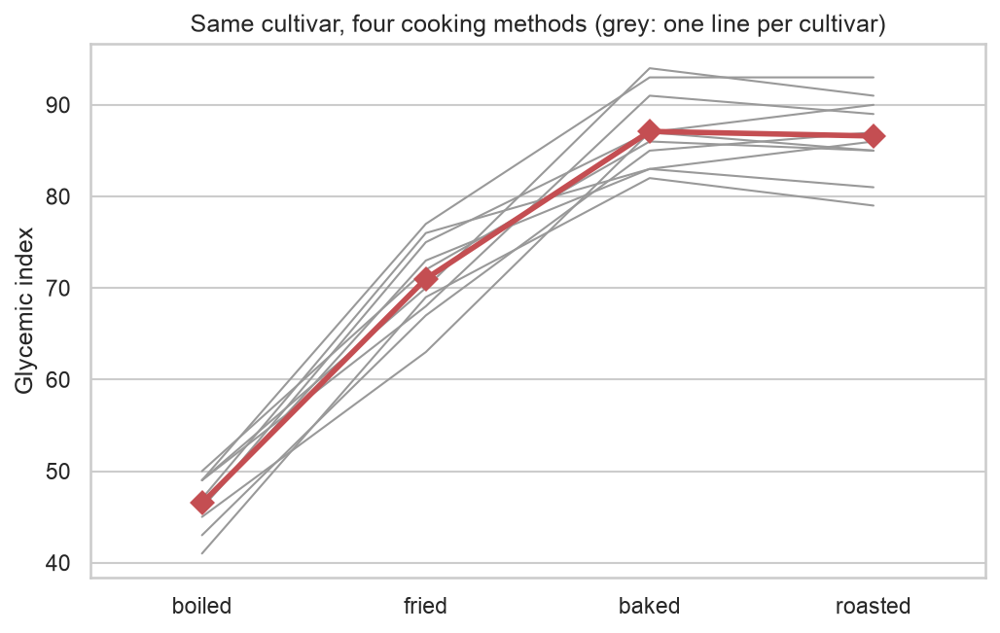
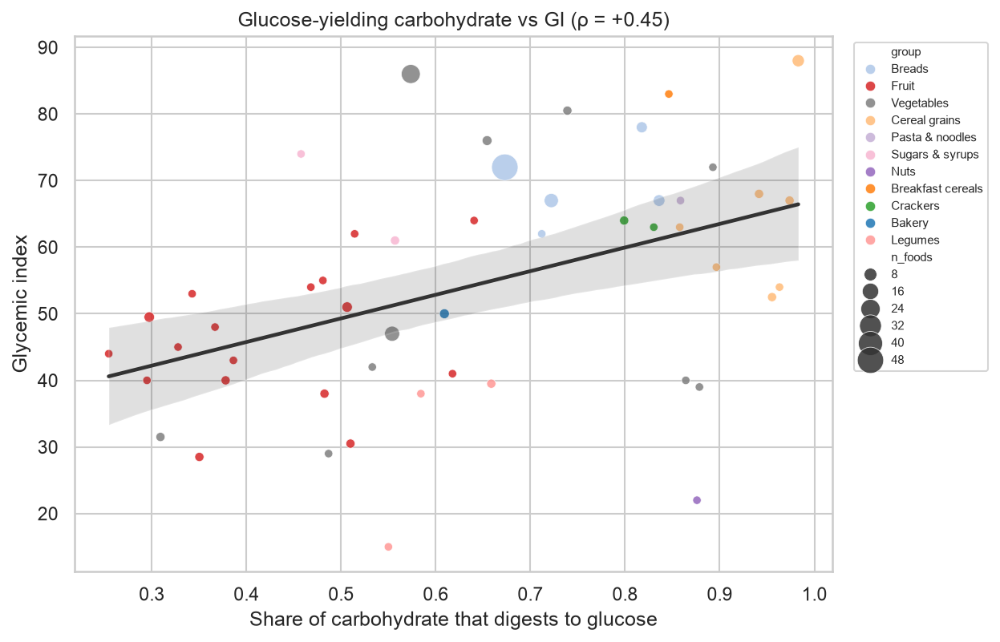

# Glycemic Index and Dietary Impact Analysis

How do food group, processing method and carbohydrate type relate to a food's glycemic index (GI) and glycemic load (GL)?

This project parses the 2021 international GI tables (2,091 foods measured to the ISO 26642:2010 standard), labels how each food was processed, and links foods to USDA carbohydrate composition, then tests four hypotheses. The full report is in [`notebooks/glycemic_index_analysis.ipynb`](notebooks/glycemic_index_analysis.ipynb).

An interactive dashboard (`app/dashboard.py`) lets you search and filter every food and explore each analysis. See [Interactive dashboard](#interactive-dashboard).

## Key findings

**1. Food group matters a lot.** GI differs strongly between the 20 food groups (Kruskal–Wallis p ≈ 10⁻¹²⁷, ε² = 0.32), and 86 of 190 group pairs differ after Holm correction. Legumes, dairy and nuts are reliably low GI; starchy vegetables, breads and refined grains are reliably high.



**2. Cooking method can move the same food across GI bands.** One study cooked ten sweet potato cultivars four ways. Boiling gave the lowest GI in every cultivar, about 47, against about 86 for baking or roasting (Friedman p = 4.5 × 10⁻⁶; Wilcoxon p = 0.002 for each method against boiling). Instant oats and instant or mashed potato point the same way but are underpowered after correction. Parboiled rice goes the other way: lower GI than ordinary boiled white rice.



**3. The carbohydrate mix predicts GI.** Across 94 distinct USDA foods, a larger starch share goes with higher GI (Spearman ρ = +0.35), and larger fiber and sugar shares with lower GI. Starch, sugar and fiber shares together explain about a quarter of the variance.

**4. The type of sugar matters more than the amount.** The share of carbohydrate that digests to glucose (starch, glucose, maltose, and half of sucrose and lactose) correlates with GI (ρ = +0.45, p = 0.001). Total sugar share barely does. Syrups that are all about 100% sugar range from GI 56 (high-fructose corn syrup) to 98 (malt syrup, mostly maltose).



**5. Glycemic load depends as much on portion as on GI.** Carbohydrate per serving explains 53% of the variance in log GL and GI explains 42%. Breads rank 2nd of 20 groups by GI but only 12th by GL; cereal grains and pasta rise to the top.

## Data

| Source | Used for |
|---|---|
| Atkinson FS, Brand-Miller JC, Foster-Powell K, Buyken AE, Goletzke J. *International tables of glycemic index and glycemic load values 2021: a systematic review.* Am J Clin Nutr 2021;114:1625–1632. Supplemental Table 1 | GI, GL, food group, test conditions |
| USDA FoodData Central, SR Legacy (April 2018) | Carbohydrate, starch, sugars, fiber, individual sugars |

Only Supplemental Table 1 is used. Its values meet ISO 26642:2010 methods; the lower-quality values in Table 2 are left out.

## Method

1. **Parse** (`src/parse_gi_table.py`). The PDF table is rebuilt from text coordinates and font styles. Bold lines mark food groups and subgroups, and wrapped lines are re-attached to their food row. The output is `data/processed/gi_table1.csv`.
2. **Label processing** (`src/label_processing.py`). A processing method (boiled, baked, fried, instant, parboiled, …) is assigned from each food's description, falling back to the section heading only when it names exactly one method.
3. **Match to USDA** (`src/match_usda.py`). Foods are matched to USDA entries by name, strictly: candidates are limited to fitting USDA categories, and variety, product form and cooking state must agree. Branded, filled or modified products are left out. Borderline matches are written to `data/processed/usda_review.csv` for hand checking and are not used.
4. **Analyse** (`src/analysis.py` and the notebook):
   - Kruskal–Wallis and Dunn tests for food groups.
   - Mann–Whitney contrasts against boiling within the same food, plus Friedman and Wilcoxon tests on the matched cultivars.
   - Spearman correlations and OLS regression on carbohydrate shares, with HC3 robust errors and errors clustered by USDA food.
   - A log-variance decomposition of glycemic load.

## Reproduce

```bash
python3 -m venv .venv
source .venv/bin/activate
pip install -r requirements.txt

python src/parse_gi_table.py   # also runs the processing labels
python src/match_usda.py
jupyter nbconvert --to notebook --execute --inplace notebooks/glycemic_index_analysis.ipynb
```

## Interactive dashboard

```bash
streamlit run app/dashboard.py
```

The dashboard opens at http://localhost:8501 and has five tabs:

| Tab | What you can do |
|---|---|
| Food explorer | Search and filter all 2,091 foods by name, group, GI band, processing method, country and GI range; hover any point for details |
| Food groups | GI by group with every food shown, the Kruskal–Wallis result and a Dunn pairwise heatmap, all recomputed for the current filter |
| Processing | Pick potato, sweet potato, rice or oats to compare cooking methods against boiling; sweet potato adds the matched ten-cultivar experiment |
| Carbohydrate type | Plot GI against starch, sugar, fiber or glucose-yielding share for the 94 matched USDA foods |
| Glycemic load | See how food groups reorder from GI to GL, and calculate the GL of your own portion of any food |

To host it publicly, connect the GitHub repository to [Streamlit Community Cloud](https://streamlit.io/cloud) and set the main file to `app/dashboard.py`.

## Repository layout

```
data/raw/          source PDFs and the USDA SR Legacy archive
data/processed/    parsed GI table, USDA matches, review list
src/               parsing, labeling, matching and analysis helpers
notebooks/         the report
app/               interactive Streamlit dashboard
figures/           charts exported by the notebook
```

## Limitations

- GI tables are not a random sample of foods: about a third of entries are Australian, and staples were tested many times.
- Processing labels come from text descriptions, so most foods have none.
- USDA composition describes a generic version of each food, not the exact product tested, and starch is estimated for about 60% of matched USDA foods.
- Apart from the matched sweet potato cultivars, the results are associations between foods, not controlled experiments.
